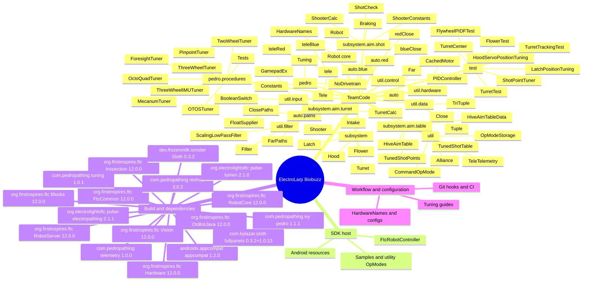
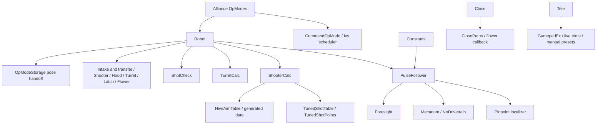

# Project mind map

Generated from current tracked sources; open mindmap.html for a searchable expandable tree.

```mermaid
mindmap
  root((ElectroLarp Biobuzz))
    TeamCode
      Robot core
        HardwareNames
        Robot
      auto
        Close
        Far
      auto.blue
        blueClose
      auto.paths
        ClosePaths
        FarPaths
      auto.red
        redClose
      pedro
        Constants
        NoDrivetrain
        Tuning
      pedro.procedures
        ForesightTuner
        MecanumTuner
        OTOSTuner
        OctoQuadTuner
        PinpointTuner
        Tests
        ThreeWheelIMUTuner
        ThreeWheelTuner
        TwoWheelTuner
      subsystem
        Flower
        Hood
        Intake
        Latch
        Shooter
        Turret
      subsystem.aim.shot
        Braking
        ShooterCalc
        ShooterConstants
        ShotCheck
      subsystem.aim.table
        HiveAimTable
        HiveAimTableData
        TunedShotPoints
        TunedShotTable
      subsystem.aim.turret
        TurretCalc
      tele
        Tele
        teleBlue
        teleRed
      test
        FlowerTest
        FlywheelPIDFTest
        HoodServoPositionTuning
        LatchPositionTuning
        ShotPointTuner
        TurretCenter
        TurretTest
        TurretTrackingTest
      util
        Alliance
        CommandOpMode
        OpModeStorage
        TeleTelemetry
      util.control
        PIDController
      util.data
        TriTuple
        Tuple
      util.filter
        Filter
        ScalingLowPassFilter
      util.hardware
        CachedMotor
      util.input
        BooleanSwitch
        FloatSupplier
        GamepadEx
    SDK host
      FtcRobotController
      Samples and utility OpModes
      Android resources
    Build and dependencies
      org.firstinspires.ftc Inspection 12.0.0
      org.firstinspires.ftc Blocks 12.0.0
      org.firstinspires.ftc RobotCore 12.0.0
      org.firstinspires.ftc RobotServer 12.0.0
      org.firstinspires.ftc OnBotJava 12.0.0
      org.firstinspires.ftc Hardware 12.0.0
      org.firstinspires.ftc FtcCommon 12.0.0
      org.firstinspires.ftc Vision 12.0.0
      androidx.appcompat appcompat 1.2.0
      com.pedropathing revhub 3.0.2
      com.pedropathing tuning 1.0.1
      com.pedropathing.ivy pedro 1.1.1
      com.pedropathing telemetry 1.0.0
      org.electrolightsftc pulse-electropathing 2.1.1
      org.electrolightsftc pulse-lumen 2.1.0
      dev.frozenmilk.sinister Sloth 0.3.2
      com.bylazar.sloth fullpanels 0.3.2+1.0.13
    Workflow and configuration
      HardwareNames and configs
      Git hooks and CI
      Tuning guides
```

## Runtime relationships

```mermaid
flowchart TD
  OpModes[Alliance OpModes] --> Lifecycle[CommandOpMode / Ivy scheduler]
  OpModes --> Robot
  Robot --> Follower[PulseFollower]
  Constants --> Follower
  Follower --> Pinpoint[Pinpoint localizer]
  Follower --> Drive[Mecanum / NoDrivetrain]
  Follower --> Foresight
  Robot --> Solver[ShooterCalc]
  Solver --> Points[TunedShotTable / TunedShotPoints]
  Solver --> Map[HiveAimTable / generated data]
  Robot --> TurretCalc
  Robot --> ShotCheck
  Robot --> Mechanisms[Intake and transfer / Shooter / Hood / Turret / Latch / Flower]
  Close --> Paths[ClosePaths / flower callback]
  Tele --> Controls[GamepadEx / live trims / manual presets]
  Robot --> Pose[OpModeStorage pose handoff]
```
